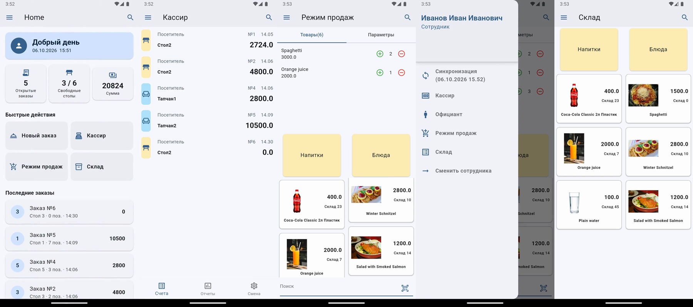
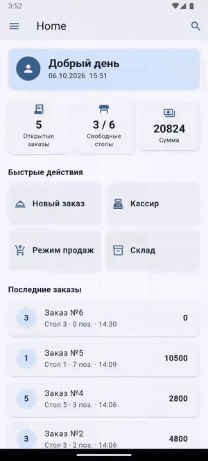

# Restaurant POS — Flutter

An offline-first point-of-sale app for small restaurants and cafés. Waiters take orders by table, the cashier closes bills, and the manager sees open orders, free tables and low stock at a glance — all without an internet connection.



<p align="center"></p>

> The UI is in Russian, the language of the café it was built for.

## Features

- **Home dashboard** — open orders, free tables, running total, quick actions, recent orders and low-stock alerts; pull to refresh
- **Tables & orders** — choose a table in the main hall or on the terrace and open a new order
- **Sales mode** — add drinks and dishes from a photo menu, change quantities, see live stock for each item
- **Cashier** — list of open bills by table with order number, time and total
- **Stock** — menu items by category with prices and quantities in stock
- **Offline-first** — all data in a local SQLite database; menu images are downloaded once, compressed and stored on the device

**In progress:** reports, shift management, staff switching and data sync.

## Tech stack

| Area | Used |
|---|---|
| UI | Flutter, Material 3 |
| State management | Riverpod (StateNotifier) |
| Local storage | SQLite (sqflite), path_provider |
| Images | http, flutter_image_compress |
| Other | intl, uuid |
| Testing | flutter_test (widget tests with provider overrides) |

## Project structure

```
lib/
├── data/        # restaurant tables and halls
├── model/       # Meal, Order
├── providers/   # Riverpod notifiers + SQLite database helpers
├── screens/     # home, waiter, sell, cashier, store, ...
└── widgets/     # reusable cards, app bar, drawer, dialogs
```

## Run

```bash
flutter pub get
flutter run
```

On first launch the app creates the local database and downloads the sample menu images.

## Tests

```bash
flutter test test/widget_test.dart
```

The home screen tests run against fake Riverpod notifiers, so no database is needed.

## Author

**Marine Petrosyan** — Android & Flutter developer
[Portfolio](https://marikpetros.lovable.app) · [LinkedIn](https://www.linkedin.com/in/marine-petrosyan-144826141/)
